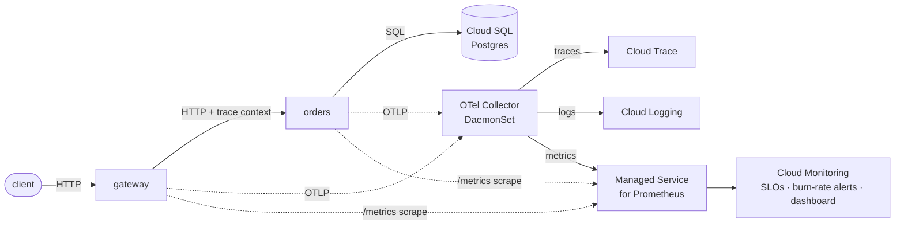

# golden-signals

SRE & observability on Google Cloud, from first principles.

This is the demo system behind a blog series on building observability the way
the discipline was invented — SLOs, error budgets, distributed tracing, and
telemetry pipelines — on Google Cloud: **GKE Autopilot, OpenTelemetry, Cloud
Monitoring, and Terraform + GitOps (Config Sync)**.

It is a small two-service app wired end to end for observability, plus all the
infrastructure and delivery code to run it in your own project. Everything is
reproducible: the GCP project is a Terraform variable, there are no secrets in
the repo, and the cluster is reconciled from Git.

---

## Architecture



**Services** (Go, in [`services/`](services/))

- **`gateway`** — the public HTTP entrypoint. No business logic; it validates
  and forwards requests to `orders` and relays the response. This is where the
  availability and latency **SLOs** are measured.
- **`orders`** — business logic; owns the `orders` table in Cloud SQL (Postgres).

Both are instrumented with **OpenTelemetry** (traces + metrics over OTLP),
emit **structured JSON logs** with trace correlation, expose `/healthz`,
`/readyz`, and a Prometheus-scrapable `/metrics`, and share a config-driven
**fault-injection layer** (see below).

**Telemetry pipeline** ([`otel/`](otel/), [`deploy/`](deploy/))

The services push OTLP to a node-local **OpenTelemetry Collector** (a GKE
DaemonSet). The collector exports **traces → Cloud Trace**, **logs → Cloud
Logging**, and **metrics → Managed Service for Prometheus (MSP)**. MSP also
scrapes the services' `/metrics` directly (via `PodMonitoring`); the SLO metrics
come from that scrape so their series names are deterministic.

**Infrastructure** ([`infra/terraform/`](infra/terraform/))

Terraform provisions GKE Autopilot, Cloud SQL, Artifact Registry, least-privilege
service accounts with Workload Identity, and the Cloud Monitoring **Service,
SLOs, multi-window multi-burn-rate alert policies, and dashboard**.

**Delivery** ([`deploy/`](deploy/), [`cloudbuild.yaml`](cloudbuild.yaml))

Cloud Build lints/tests and builds/pushes images to Artifact Registry; **Config
Sync** reconciles the Kubernetes manifests from this repo into the cluster.

---

## Request & trace flow

1. A client calls the gateway, e.g. `POST /checkout {"item":"widget","quantity":2}`.
2. `otelhttp` starts a **server span** on the gateway and records request metrics.
3. The gateway calls `orders` (`POST /orders`) over an `otelhttp`-instrumented
   client, which **propagates the W3C trace context** and creates a client span.
4. `orders` starts its own server span, runs the DB insert (a child span), and
   returns the created order.
5. The gateway relays the response. All spans share one **trace ID**; each log
   line emitted during the request carries `trace_id`/`span_id`, so a trace in
   Cloud Trace links straight to its logs in Cloud Logging.

Simulated `X-Cohort` and `X-Region` request headers are attached to spans as
`user.cohort` / `user.region` — high-cardinality attributes used in the series
to demonstrate narrow-blast-radius debugging.

---

## Fault injection

Both services share [`internal/faultinject`](internal/faultinject), a
config-driven layer that injects **latency**, **request aborts**, and
**dependency slowness** — optionally **scoped by endpoint, cohort, or region** —
so you can burn an error budget or run a game-day on cue. It is **disabled by
default**; every knob is an environment variable.

### Simple knobs (one rule)

| Variable | Meaning |
|---|---|
| `FAULT_ENABLED` | `true` to activate the injector (default off). |
| `FAULT_SEED` | Optional RNG seed for reproducible faults. |
| `FAULT_MATCH_ENDPOINT` | Glob on the request path, e.g. `/checkout` (empty = all). |
| `FAULT_MATCH_COHORT` | Glob on the `X-Cohort` header (empty = all). |
| `FAULT_MATCH_REGION` | Glob on the `X-Region` header (empty = all). |
| `FAULT_LATENCY_PROB` | Probability (0–1) of adding request latency. |
| `FAULT_LATENCY_MIN_MS` / `FAULT_LATENCY_MAX_MS` | Injected latency window. |
| `FAULT_ABORT_PROB` | Probability (0–1) of aborting the request. |
| `FAULT_ABORT_STATUS` | HTTP status for aborts (default 503). |
| `FAULT_DEP_LATENCY_PROB` | Probability (0–1) of slowing a dependency call (orders→DB, gateway→orders). |
| `FAULT_DEP_LATENCY_MIN_MS` / `FAULT_DEP_LATENCY_MAX_MS` | Dependency slowdown window. |

### Rule-based config (many rules)

Set `FAULT_RULES` to a JSON array to scope several faults at once. It overrides
the simple knobs. Example — abort a quarter of `/checkout` traffic **only** for
the `canary` cohort in `emea`, and add latency to everything there:

```json
[
  {
    "name": "burn-checkout-emea-canary",
    "match": { "endpoint": "/checkout", "cohort": "canary", "region": "emea" },
    "latency": { "probability": 1.0, "min_ms": 200, "max_ms": 800 },
    "abort":   { "probability": 0.25, "status": 503 }
  }
]
```

Because injected aborts and latency flow through the same metrics/spans as real
traffic, they show up in the golden-signals dashboard and drive the burn-rate
alerts — exactly as a genuine incident would.

---

## Run locally

Requires Docker. Brings up Postgres + both services (the OTLP exporter simply
logs connection errors if no collector is running — the app still serves):

```bash
docker compose up --build

# create an order through the gateway
curl -XPOST localhost:8080/checkout -d '{"item":"widget","quantity":2}'
# read it back
curl localhost:8080/orders/1
# scrape metrics
curl localhost:8080/metrics

# run a fault: abort half of checkouts
FAULT_ENABLED=true docker compose up --build   # then set knobs in docker-compose.yaml
```

Build and test the Go code directly:

```bash
go build ./...
go test ./...
```

---

## Deploy to your own GCP project

For the full repeatable bootstrap → build-triggers → teardown flow, see
[`DEPLOY.md`](DEPLOY.md): [`bootstrap.sh`](bootstrap.sh) stands up the APIs,
Terraform state bucket, and provisioning service account, and
[`scripts/create-triggers.sh`](scripts/create-triggers.sh) creates the Cloud
Build infra/app triggers. The steps below are the manual Terraform + Config Sync
path.

Prerequisites: `gcloud`, `terraform` (≥ 1.5), `kubectl`, and a GCP project with
billing enabled. Region defaults to `us-central1`.

### 1. Provision infrastructure (Terraform)

```bash
cd infra/terraform

# One-time: a GCS bucket for remote state.
gcloud storage buckets create gs://YOUR_TF_STATE_BUCKET --location=us-central1

cp terraform.example.tfvars terraform.tfvars
# edit terraform.tfvars: set project_id (required)

terraform init -backend-config="bucket=YOUR_TF_STATE_BUCKET"
terraform plan
terraform apply
```

This creates GKE Autopilot, Cloud SQL, Artifact Registry, the service accounts +
Workload Identity bindings, and the Cloud Monitoring SLOs, alerts, and dashboard.
See [`infra/terraform/README.md`](infra/terraform/README.md) for details.
`terraform output` prints the values you need next (image repo, GSA emails, the
DB-URL secret, the kubectl credentials command).

### 2. Build & push images (Cloud Build)

The operator connects the GitHub ↔ Cloud Build host connection and creates a
trigger (out of scope for this repo). To build ad hoc:

```bash
gcloud builds submit --config cloudbuild.yaml \
  --substitutions=_REGION=us-central1,_REPO=golden-signals
```

Images land in Artifact Registry tagged with the commit SHA and `latest`.

### 3. Reconcile the cluster (Config Sync)

```bash
gcloud container clusters get-credentials golden-signals-cluster \
  --region us-central1 --project YOUR_PROJECT
```

Then follow [`deploy/README.md`](deploy/README.md): substitute your project ID
and image tags into the overlay, create the `orders-db` Secret from the Secret
Manager value Terraform stored, and apply the `RootSync` so Config Sync
reconciles `deploy/overlays/prod`.

---

## Repository layout

| Path | What |
|---|---|
| [`services/gateway`](services/gateway), [`services/orders`](services/orders) | The two Go services + Dockerfiles. |
| [`internal/`](internal) | Shared packages: `telemetry`, `faultinject`, `httpx`, `config`. |
| [`otel/`](otel) | Standalone OpenTelemetry Collector config. |
| [`infra/terraform/`](infra/terraform) | GKE, Cloud SQL, Artifact Registry, IAM/WI, SLOs/alerts/dashboard. |
| [`deploy/`](deploy) | Config Sync layout: base manifests + prod overlay + `RootSync`. |
| [`cloudbuild.yaml`](cloudbuild.yaml) | CI: lint/test + build/push images. |

## Design notes & choices

- **Gateway is the SLO boundary.** SLIs are computed from the gateway's native
  Prometheus request metrics (`http_requests_total`,
  `http_request_duration_seconds`), scraped into MSP via `PodMonitoring`, so the
  Cloud Monitoring SLOs reference stable series names.
- **Node-local collector.** The collector runs as a DaemonSet; pods send OTLP to
  their node's collector via `status.hostIP`. Swap to a Deployment + Service if
  you prefer a central collector.
- **Cloud SQL over private IP** with the password stored in Secret Manager (never
  in state outputs or Git). IAM database auth via the Cloud SQL Auth Proxy is a
  reasonable hardening step left out of the foundation for simplicity.
- **Scope:** this is the foundation for blog posts #1–#4. The Pub/Sub
  `fulfillment` worker / streaming path is intentionally **not** included yet.

## License

[Apache-2.0](LICENSE).
